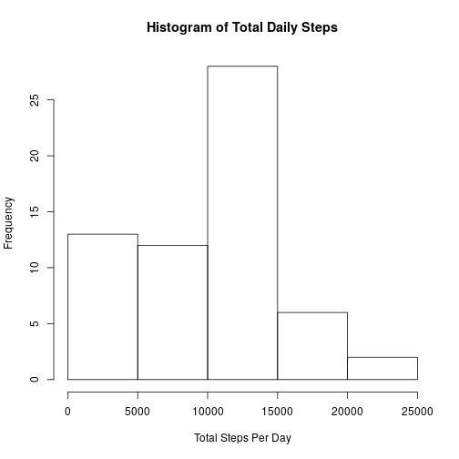
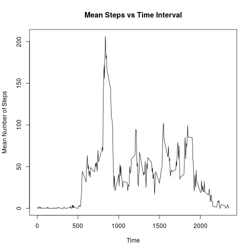
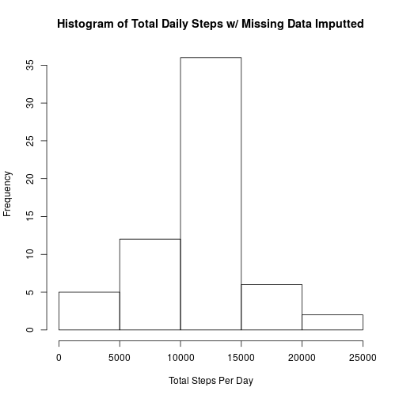
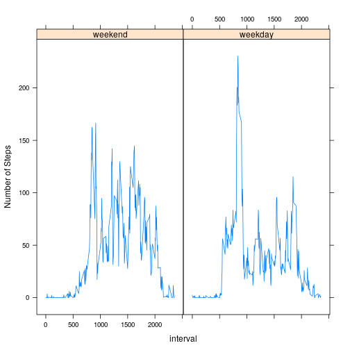

## Loading and preprocessing the data
Here, I will download the compressed data file and decompress it, albeit only if the file or the underlying csv do not exist.

Then, I will load the data using read.csv()

```r
UrlFile="https://d396qusza40orc.cloudfront.net/repdata%2Fdata%2Factivity.zip"
ZipFile="activity.zip"
CsvFile="activity.csv"

if(!file.exists(ZipFile)){
  download.file(url = UrlFile,destfile = ZipFile,mode = "wb")
}

if(!file.exists(CsvFile)){
  unzip(ZipFile)
}

DataFrame = read.csv(CsvFile)
```


## What is mean total number of steps taken per day?
I store the total number of steps per day with "NA" data removed

```r
DailySteps = setNames(aggregate(DataFrame$steps,by=list(date=DataFrame$date),
                                FUN=sum,na.rm=TRUE),c("date","steps"))
```
I will create a histogram of the Total Daily Steps.

```r
hist(DailySteps$steps,xlab = "Total Steps Per Day",main = "Histogram of Total Daily Steps")
```



I calculate and display the mean and median of these total daily steps.

```r
MeanData = mean(DailySteps$steps)
MedianData = median(DailySteps$steps)
```
The mean and median of the total steps per day are 9354.2295082 and 10395.

## What is the average daily activity pattern?
I store the average number of steps per day with "NA" data removed

```r
MeanSteps = setNames(aggregate(DataFrame$steps,by=list(interval=DataFrame$interval),
                                FUN=mean,na.rm=TRUE),c("interval","steps"))
```
I created a line graph/plot of the steps vs time intervals.

```r
plot(MeanSteps$steps~MeanSteps$interval,type="l", xlab="Time", 
     ylab="Mean Number of Steps",main="Mean Steps vs Time Interval")
```



I store the interval with the maximum/largest average number of steps and display it.

```r
MaxMeanSteps = MeanSteps[which.max(MeanSteps$steps),]$interval
```

The maximum of the average number of is held in interval 835.

## Imputing missing values
I sum up all the occurences of missing values (NAs) in the steps column of the data frame.

```r
NAs = sum(is.na(DataFrame$steps))
```
The total number of rows with missing values is 2304.

I created a copy of the data frame then replaced the missing values with the rounded value of the mean for that interval.

```r
cleanDF = DataFrame

for(i in 1:nrow(cleanDF)){
  if(is.na(cleanDF[i,]$steps)){
    interv = cleanDF[i,]$interval
    cleanDF[i,]$steps = round(MeanSteps[which(MeanSteps$interval == interv),]$steps)}
}
```

I summed up the number steps by day.

```r
CleanDailySteps = setNames(aggregate(cleanDF$steps,by=list(date=cleanDF$date),
                                     FUN=sum,na.rm=TRUE),c("date","steps"))
```

I display a histogram of the the total steps with the imputted data

```r
hist(CleanDailySteps$steps,xlab = "Total Steps Per Day", 
     main = "Histogram of Total Daily Steps w/ Missing Data Imputted")
```



I calculated and displayed the new mean and median values for the imputted data set.

```r
CleanMeanData = mean(CleanDailySteps$steps)
CleanMedianData = median(CleanDailySteps$steps)
```
The mean and median of the total steps (w/ missing values inputted) per day are 1.0765639 &times; 10<sup>4</sup> and 1.0762 &times; 10<sup>4</sup>.

These values differ from the estimates in part 1 of this assignment. Imputting missing data changed increased the Mean and Median values.

## Are there differences in activity patterns between weekdays and weekends?
I added a column with factor of weekend vs weekday to the imputted data set 

```r
library(chron)
cleanDF$WkDayWkEnd = factor(is.weekend(as.Date(cleanDF$date,format="%Y-%m-%d")),
                            levels=c(TRUE,FALSE),labels=c("weekend","weekday"))
```

I created the average by interval and by the type of day (weekday vs weekend).

```r
WeeklyMeanSteps = setNames(aggregate(cleanDF$steps, 
                                     by=list(cleanDF$WkDayWkEnd, interval=cleanDF$interval),
                                     FUN=mean,na.rm=TRUE),
                           c("dayType","interval","steps"))
```

I plotted the steps vs interval data separated out by weekday vs weekend.

```r
library(lattice)
xyplot(steps ~ interval|dayType, data=WeeklyMeanSteps,type='l', 
       ylab="Number of Steps")
```


